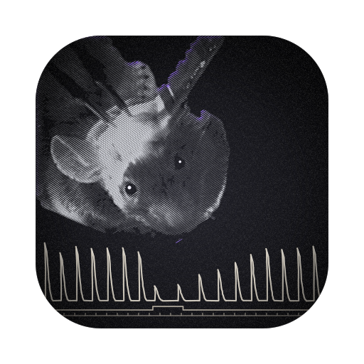

# syncviewR

A Rust port of [syncview](https://github.com/matthewperkins/syncview): view Open Ephys recordings
side by side with a behaviour video, frame-locked to the camera trigger. Built with
[egui](https://github.com/emilk/egui)/eframe for the interface, [wgpu](https://wgpu.rs) (Vulkan,
Metal, DirectX) for drawing the traces, and FFmpeg (`ffmpeg-next`) for video.


*syncviewR on macOS: 4 of 16 channels of a 10-minute excerpt (masseter and digastric EMG, antrum and
duodenum slow waves) with the antrum's slow-wave power across the excerpt (bottom; the shaded box is
the current view).*

MIT-licensed (see `LICENSE`). Written mostly by an AI model; see [Provenance](#provenance).

**Status:** the viewer and channel editor are ported. It reads the same recordings, presets and
cache folder as the Python version. Not yet ported: clip export.

## Install

**Prebuilt (macOS, Apple silicon).** In Terminal:

```bash
cd ~/Downloads
curl -L -O https://github.com/matthewperkins/syncviewR/releases/latest/download/syncviewr-macos-arm64.zip
unzip -o syncviewr-macos-arm64.zip syncviewr
./syncviewr --demo
```

To run it from any folder, move it onto your PATH: `sudo mv syncviewr /usr/local/bin/`. The build is
not signed with an Apple Developer ID. A file downloaded with `curl` isn't marked as quarantined,
so macOS runs it straight away. If you download the zip with a browser instead, clear the flag once
with `xattr -d com.apple.quarantine syncviewr`, or use System Settings → Privacy & Security →
Open Anyway. Other platforms, and Intel Macs, build from source as below.

**From source.** You need Rust (1.85 or newer) and a C compiler. The `static-ffmpeg` option compiles FFmpeg into
syncviewR, so nothing else is needed and the program keeps working when system packages change.

```bash
# macOS (once): Apple's compiler tools and Rust
xcode-select --install
brew install rust            # or https://rustup.rs

# then
cargo install --git https://github.com/matthewperkins/syncviewR --features static-ffmpeg
```

That builds and installs the `syncviewr` command into `~/.cargo/bin` (add it to your PATH if your
shell doesn't find it). The first build takes about 5–10 minutes, most of it compiling FFmpeg. To
update, run the same command again.

On Linux the same command works; x86-64 also needs `nasm` (e.g. `sudo pacman -S nasm`).

**Building against the system's FFmpeg instead** (faster first build, but it has to be rebuilt
whenever the system's FFmpeg changes major version): install FFmpeg's libraries and `pkgconf`
(`brew install ffmpeg pkgconf`, or `sudo pacman -S ffmpeg`) and leave out `--features static-ffmpeg`.
From a checkout: `cargo build --release` gives `target/release/syncviewr`.

## Try it without a rig

```bash
syncviewr --demo
```

This writes a synthetic five-minute recording, a matching cartoon video and a preset (~100 MB, about
10 s, first run only) into the cache folder, then opens them. It contains a chewing jaw (masseter and
digastric EMG, a jaw-position sensor and a bipolar masseter pair whose reference wire carries only
hum and movement artefact), antral slow waves that grow after each meal, duodenal slow waves, and
mains hum for the notch. Each video frame shows its frame number and its trigger's time, so the
sync can be checked by eye. `syncviewr --demo DIR` writes it into DIR instead. The folder is an
ordinary Open Ephys recording, so Python syncview opens it too (see its `README.txt`).

## Run

```bash
syncviewr --rec "/path/to/Record Node 101/experiment1/recording1" \
          --video /path/to/BASLER_CAM_….mp4 \
          --preset presets.json          # optional; default: all electrode channels as EMG
```

| option | default | |
|---|---|---|
| `--rec FOLDER` | (required unless `--demo`) | Open Ephys recording folder (contains `structure.oebin`) |
| `--video FILE` | none | video recorded during this recording |
| `--preset FILE.json` | built from the recording | same JSON as Python syncview |
| `--stream NAME` | `acquisition_board` | Open Ephys continuous stream |
| `--trigger-line N` | `1` | TTL line with one pulse per video frame |
| `--cache FOLDER` | `$SYNCVIEWR_CACHE`, else `~/.cache/syncviewr` (Linux), `~/Library/Caches/syncviewr` (macOS) | filtered traces |
| `--time S`, `--time-base S`, `--play` | | initial position, view width, start playing |

Controls are as in syncview: scroll = zoom time; sideways swipe, Shift+scroll or drag = pan;
⌘/Ctrl+scroll = scale one row's Y, double-click = reset it; click/drag the overview strip to jump;
←/→ one video frame (Shift: 10 % of the view), PgUp/PgDn, Home/End, Space play, [ / ] speed, +/- zoom.

**Channel table** (right): Show, Label, Ch, Ref (bipolar reference), Mode, Low/High Hz (blank =
no filter edge), Notch (e.g. `60` or `60,180`), DSP wzrd (`order=3 smooth_ms=10 env_lp=40 plot_fs=1000
win_s=30`), Y range (`auto` or `lo, hi`). Text fields apply on Enter or when you click away; input
that doesn't parse reverts. Changing a row's mode resets its band and DSP wzrd settings to that mode's
defaults (Python syncview keeps the old band). Click a row's number to select it for Up / Down /
Remove and as the template for Add. **Load…/Save…** read and write presets in the Python format
(time base, rows, overview); **Video…** attaches a video.

**Sharing a cache with Python syncview.** Cache entries use the same keys and layout, so
`--cache` pointed at a Python syncview cache folder reuses its filtered traces and video indexes
(and vice versa).

## How it draws

Each row is one GPU line strip (`src/gpu.rs`), drawn inside egui's render pass through an
`egui_wgpu` paint callback. As in syncview, a row never has more points than pixel columns: the
whole session is filtered once into a min/max pyramid on disk (`src/cache.rs`), and each frame reads
the coarsest level with at least one block per pixel column. On high-DPI screens each strip is drawn
three times, offset by one physical pixel, to get ~2 px lines.

## Checked

- **Filters vs scipy/Python:** `cargo test` compares every mode (plus notch, odd order and
  high-pass-only variants) with Python syncview's output on 200 s of synthetic data: max relative
  difference 10⁻⁹ (slow mode) to 10⁻¹⁵. Run `tests/make_fixtures.py` with a Python that has
  syncview first to generate the references (55 MB, not in git). Cache keys match Python's exactly.
- **Whole-session cache:** against Python's cache for a 10-minute excerpt: same lengths and pyramid
  depth, identical statistics, differences at float32 rounding. Built 17 traces in 5 s (Python ≈ 33 s).
- **Video:** frames at 14 indexes (incl. both sides of keyframes and the last frame) are the same
  frames Python's decoder returns (mean grey difference 0.005 vs ≥ 0.33 between neighbours).
- **GUI:** Linux (Hyprland/Wayland, Vulkan, NVIDIA T400), 1648×983, 16 rows + video playing at 1×:
  58–60 frames/s (the display's refresh rate). macOS (Apple silicon, Metal, Retina; Homebrew Rust,
  FFmpeg and pkgconf): builds and runs with the 10-minute excerpt; trackpad and keys behave well.
- **Not yet checked:** Windows, multi-hour recordings, detailed trackpad/keyboard feel.

## Provenance

Written by **Claude** (Anthropic), model **Claude Opus 5.5** (`claude-opus-5-5`, training cutoff
June 2026), in Claude Code on 2026-10-07/08, directed by **Matthew Perkins**, who holds the
copyright. It is a port of the Python syncview written the same way; the invariants listed in that
README's Provenance section (sync rule, frame indexing by packet-timestamp rank, cache keys) apply
here too and are what the tests above check.
